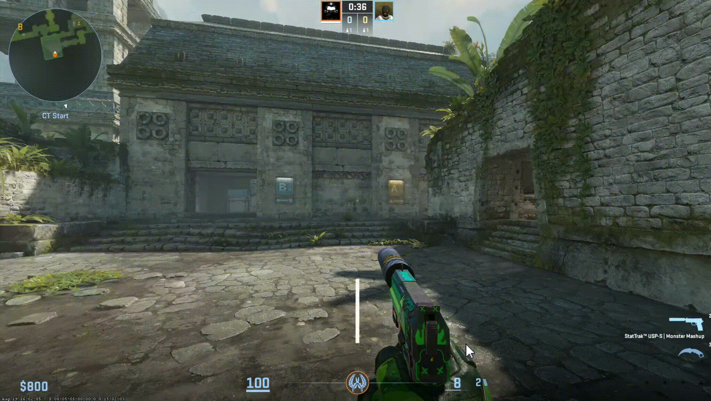
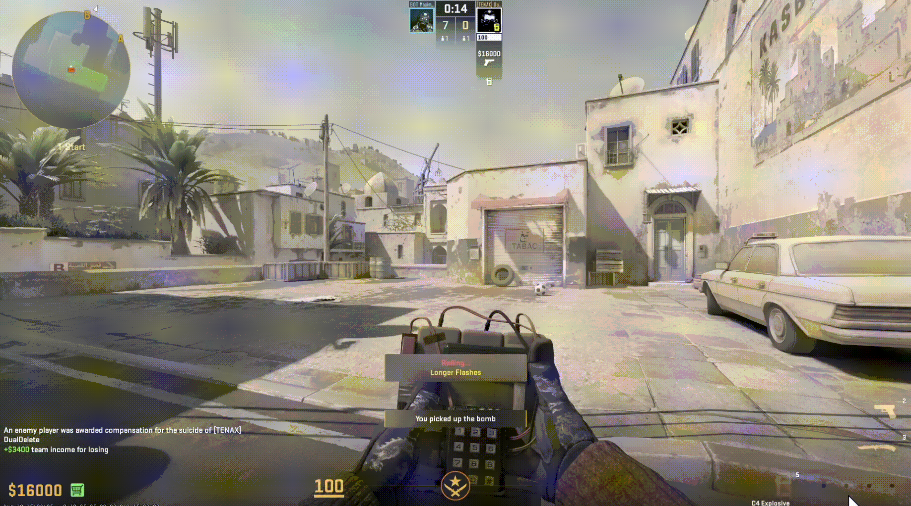

> 🤖 **This plugin was created with [Claude AI](https://claude.ai).**

<div align="center">
  <h1><strong>CSRoll</strong></h1>
  <p>A chaos-mod style plugin for CS2, built on <a href="https://swiftlys2.net">SwiftlyS2</a>.</p>
</div>

Each round all players roll a random modifiers that apply for a round.
|  |  |
|--|--|
|  |  |

## Modifier List

| Modifier | Description |
| --- | --- |
| Cluster Grenades | Grenades spawn mini grenades (configurable) |
| Suicide Bomber | On death, drop grenades dealing bonus HE damage (configurable) |
| Conditional Invisibility | Invisible while silent - sound reveals you |
| Vanish | Press Inspect Weapon to vanish briefly - on a cooldown |
| Drunk | A/D movement is mirrored |
| Juggernaut | Max health set to 300 |
| Random Health | Random health |
| Flashing Bullets | Chance to blind an enemy you hit |
| Disarming Bullets | Chance to disarm an enemy you hit |
| Hard Head | Immune to headshots |
| Butterfingers | Miss a shot, drop your weapon |
| Boomerang Bullets | Missed shots damage you - bonus health |
| Steel Body | Only headshots and utility hurt you |
| More Damage | Deal 33% more damage |
| Revive | Chance to survive lethal damage |
| Small Players | 2x smaller, 50 HP |
| Poisonous Smoke | Your smokes damage enemies inside them |
| Longer Flashes | Flashes last longer (configurable) |
| Chinese Grenades | Randomized grenade fuse timers |
| Swap On Death | Swap places on kill |
| Swap On Hit | Swap places on hit |
| Master Zeus | Zeus recharges fast and hits at long range |
| Smoke Immunity | Smokes are invisible - VAC SAFE |
| Vampire | Heal for the damage you deal |
| Saint | Chance for a kill to revive a dead teammate |
| Speedhack | You are really fast |
| Teleport On Reload | Reloading teleports you to spawn |
| Teleport On Hit | Getting hit teleports you to spawn |
| One Per Reload | 1 bullet per reload |
| No Recoil | No recoil |
| Wallhack | Free cheats, for free - VAC SAFE |
| Random Loadout | Random loadout |
| Walking Grenadier | No guns - unlimited HE grenades |
| Heavy Boots | Much slower - armor, helmet and bonus health |
| Jetpack | Hold jump in the air to thrust |
| Bunny Hop | Hold jump to auto bunny-hop |
| Infinite Ammo | All weapons go brrrrrr... |
| Atomic Explosions | HE grenades deal much more damage |
| Increased Spread | Your aim just got worse... |
| Plant Anywhere | Plant anywhere after a delay (configurable) |
| Flanker | Press Inspect Weapon to teleport behind an enemy |
| Regeneration | Heals over time - faster standing still |
| Bounty | Damage enemies for bonus money |
| Weapon Roulette | Random weapon, re-rolled often |

Display names and descriptions are fully customizable via `resources/translations/en.jsonc`.

## Commands

All commands are chat commands (prefix with `!`).

| Command | Access | Description |
| --- | --- | --- |
| `!rolllist` | Everyone | Prints the name and description for each registered modifier. |
| `!rollactive` | Everyone | Prints the name, scope (Global or which player(s)), and description for each active modifier. |
| `!rollhelp` | Everyone | Prints every available CSRoll command. |
| `!rollmenu` | Admin | Opens the CSRoll configuration menu (random rounds, modifiers-per-player, per-modifier enable/disable). |
| `!memodifier <name>` | Admin | Apply a modifier scoped to just yourself, without affecting anyone else. |
| `!rolltoggle <name>` | Admin | Adds the modifier globally if inactive, removes it (from everyone currently assigned) if active. |
| `!removemodifier <name>` | Admin | Remove an active modifier. |
| `!removemodifiers` | Admin | Clear / Remove all active modifiers. |
| `!disablemodifier <name>` | Admin | Deactivate a modifier and remove it from the registered pool so it can't be added/rolled again until re-enabled (`!rollmenu`) or the plugin reloads. |
| `!addrandommodifier` | Admin | Add a random modifier to be activated immediately. |
| `!randomrounds` | Admin | Toggle random rounds on/off. |
| `!randomroundsreroll` | Admin | Re-roll the current random round modifiers and apply them to the current round. |
| `!rollreload` | Admin | Reload `config.jsonc` from disk without restarting the plugin or resetting active modifiers. |
| `!rolldebug` | Admin | Toggle whether per-player random-round assignments are reported to admins in chat. |

`MinRandomRounds`/`MaxRandomRounds` have no dedicated chat command - set them in `config.jsonc`, or adjust them at runtime via `!rollmenu` (menu changes are runtime-only and revert to the config file on the next full plugin reload). `Wallhack` is a regular modifier (manage it like any other via `!rolltoggle Wallhack` or `!memodifier`), not a dedicated command.

## Installation

1. Build the plugin (or grab a prebuilt release zip):
   ```bash
   dotnet publish -c Release
   ```
2. Copy the published output (the `CSRoll` folder from `build/publish`, containing the DLL and `resources/` folder) into your CS2 server's:
   ```
   game/csgo/addons/swiftlys2/plugins/CSRoll/
   ```
   (i.e. the `SwiftlyS2/Plugins` folder for your server - the exact path depends on your SwiftlyS2 installation).
3. Restart the server, or use SwiftlyS2's plugin reload command if supported.
4. Tune behavior in the generated `config.jsonc` and `resources/translations/en.jsonc` files - both support editing without a rebuild (see comments inside each file for hot-reload behavior).

Requires [SwiftlyS2](https://swiftlys2.net) to be installed on your CS2 server.

## Credits

CSRoll is a SwiftlyS2/C# reimplementation, inspired by CounterStrikeSharp game modifiers plugin:

- [CS2-GameModifiers-Plugin](https://github.com/vinicius-trev/CS2-GameModifiers-Plugin) by vinicius-trev

Built on the [SwiftlyS2](https://swiftlys2.net) plugin framework.
